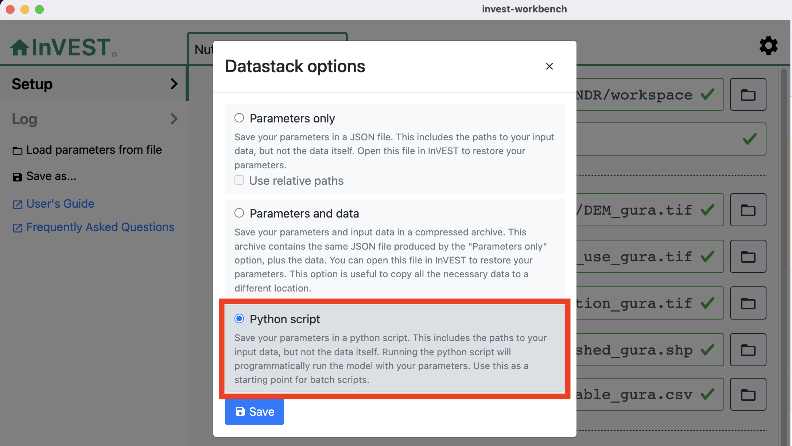

.. _scripting:

*************************************
Tutorial: Batch Processing on Windows
*************************************

============
Introduction
============

These are the steps that will need to be taken in order to use the batch
scripting framework for InVEST models available in the ``natcap.invest`` python
package.

For those wishing to do batch-processing with InVEST without setting up a
Python scripting environment, see :ref:`cli` for examples of how to run
InVEST models from the command-line.

==================================
Setting up your Python environment
==================================

We recommend using the ``conda`` or ``mamba`` package manager to create an
environment.  The easiest way to do so is to execute the following command::

        mamba create -n invest-env -c conda-forge natcap.invest

This will create a new environment called ``invest-env`` with the latest
released versions of python and ``natcap.invest``, as well as all dependencies
needed to execute ``natcap.invest``.

Alternate installation methods are available. Please see the :ref:`installing`
guide for further instructions on setting up your python environment and
installing the ``natcap.invest`` package.

.. _CreatingPythonScripts:

=======================
Creating Python Scripts
=======================

1. **Launch InVEST Workbench and Open the Selected Model**

   Once you have selected an InVEST model to script, launch the workbench and
   select the model from the list of available models.  This guide will follow
   the Nutrient Delivery Ratio (NDR) model.

2. **Fill in InVEST Model Input Parameters**

   Once the user interface loads, populate the inputs in the model likely to
   be used in the Python script.  For testing purposes the default InVEST’s
   data is appropriate.  However, if you wish to write a script to execute
   several InVEST model runs in sequence, it would be reasonable to populate
   the user interface with data for the first run in the sequence.

3. **Generate a Python Script from the User Interface**

   In the model interface, select *"Save as..."* in the left-hand menu bar,
   *"Python script"* in the dialog box, and then save the file to a known location.

   |workbench_save_as.png|
   |modal_save_as.png|

.. |workbench_save_as.png| image:: scripting/workbench_save_as.png

4. **Execute the script in the InVEST Python Environment**

   Launch a shell of your choice and activate your InVEST environment you
   created earlier. We will use the Windows command prompt ``cmd.exe`` for an
   example, but the same commands should work on Powershell, bash and zsh.  If
   you created an environment called ``invest-env``, you would activate it with
   ``conda`` like so::

        > conda activate invest-env

   You will know your environment activated correctly when you see the
   environment name at the beginning of your shell prompt.  For example::

        (invest-env) C:\Users\demo >

   Once the environment has been activated, we can run the python script we
   saved in the previous step.  Suppose we're on Windows and the script was
   saved to ``C:\Users\demo\Desktop\ndr.py``, the command to run the script
   would be::

        (invest-env) C:\Users\demo > python C:\Users\demo\Desktop\ndr.py

5. **Output Results**

   As the model executes, status information will be printed to the console.
   Once complete, model results can be found in the workspace folder selected
   during the initial configuration.

=========================
Modifying a Python Script
=========================

InVEST Python scripts consist of two sections:

* The argument dictionary that represents the model’s user interface input
  boxes and parameters.
* The call to the InVEST model itself.

For reference, consider the following script generated by the Nutrient model with default data inputs:

.. code-block:: python

    # coding=UTF-8
    # -----------------------------------------------
    # Generated by InVEST 3.14.2 on Wed Oct 23 10:49:40 2024
    # Model: Nutrient Delivery Ratio

    import logging
    import sys

    import natcap.invest.ndr.ndr
    import natcap.invest.utils

    LOGGER = logging.getLogger(__name__)
    root_logger = logging.getLogger()

    handler = logging.StreamHandler(sys.stdout)
    formatter = logging.Formatter(
        fmt=natcap.invest.utils.LOG_FMT,
        datefmt='%m/%d/%Y %H:%M:%S ')
    handler.setFormatter(formatter)
    logging.basicConfig(level=logging.INFO, handlers=[handler])

    args = {
        'biophysical_table_path': 'C:\\Users\demo\invest-sample-data\\NDR\\biophysical_table_gura.csv',
        'calc_n': True,
        'calc_p': True,
        'dem_path': 'C:\\Users\demo\invest-sample-data\\NDR\\DEM_gura.tif',
        'k_param': '2',
        'lulc_path': 'C:\\Users\demo\invest-sample-data\\NDR\land_use_gura.tif',
        'results_suffix': 'gura',
        'runoff_proxy_path': 'C:\\Users\demo\invest-sample-data\\NDR\precipitation_gura.tif',
        'subsurface_critical_length_n': '200',
        'subsurface_eff_n': '0.8',
        'threshold_flow_accumulation': '1000',
        'watersheds_path': 'C:\\Users\demo\invest-sample-data\\NDR\watershed_gura.shp',
        'workspace_dir': 'C:\\Users\demo\invest-sample-data\\NDR\workspace',
    }

    if __name__ == '__main__':
        natcap.invest.ndr.ndr.execute(args)

Elements to note:

* *Parameter Python Dictionary*: Key elements include the ``'args'``
  dictionary.  Note the similarities between the key values such as
  ``'workspace_dir'`` and the equivalent "Workspace" input parameter in the
  user interface.  Every key in the ``'args'`` dictionary has a corresponding
  reference in the user interface.

  In the example below we’ll modify the script to execute the nutrient model
  for a parameter study of ``'threshold_flow_accumulation'``.

* *Execution of the InVEST model*: The InVEST API invokes models with a
  consistent syntax where the module name that contains the InVEST model is
  listed first and is followed by a function called ‘execute’ that takes a
  single parameter called ``'args'``. This parameter is the dictionary of input
  parameters discussed above.  In this example, the line ::

        natcap.invest.ndr.ndr.execute(args)

  executes the nutrient model end-to-end.  If the user wishes to make batch
  calls to InVEST, this line will likely be placed inside a loop.

* *The file registry dictionary*: As of version 3.17.0, the ``execute``
  function of each invest model returns a dictionary summarizing all output
  files produced by the model. It maps output IDs (found in the model's
  ``MODEL_SPEC``) to the absolute paths where those outputs were created. This
  may be used to access model results programmatically for subsequent data
  processing.

====================================================
Example: Threshold Flow Accumulation Parameter Study
====================================================

This example executes the InVEST NDR model on 10 values of threshold
accumulation stepping from 500 to 1000 pixels in steps of 50.  To modify the
script above, replace the execution call with the following loop:

.. code-block:: python

    if __name__ == '__main__':
        #Loops through the values 500, 550, 600, ... 1000
        for threshold_flow_accumulation in range(500, 1001, 50):
            #set the accumulation threshold to the current value in the loop
            args['threshold_flow_accumulation'] = threshold_flow_accumulation
            #set the suffix to be accum### for the current threshold_flow_accumulation
            args['suffix'] = 'accum' + str(threshold_flow_accumulation)
            natcap.invest.ndr.ndr.execute(args)

This loop executes the InVEST nutrient model 10 times for accumulation values
``500, 550, 600, ... 1000`` and adds a suffix to the output files so results
can be distinguished.

===========================================================
Example: Invoke NDR Model on a directory of Land Cover Maps
===========================================================

In this case we invoke the InVEST nutrient model on a directory of land cover
data located at C:\User\Rich\Desktop\landcover_data.  As in the previous
example, replace the last line in the UI generated Python script with:

.. code-block:: python

    import os
    landcover_dir = r'C:\User\demo\Desktop\landcover_data'

    if __name__ == '__main__':
        #Loop over all the filenames in the landcover dir
        for landcover_file in os.listdir(landcover_dir):
            #Point the landuse uri parameter at the directory+filename
            args['lulc_uri'] = os.path.join(landcover_dir, landcover_file)
            #Make a useful suffix so we can differentiate the results
            args['suffix'] = 'landmap' + os.path.splitext(landcover_file)[0]
            #call the nutrient model
            natcap.invest.ndr.ndr.execute(args)

This loop covers all the files located in
``C:\User\demo\Desktop\landcover_data`` and updates the relevant ``lulc_uri``
key in the args dictionary to each of those files during execution as well as
making a useful suffix so output files can be distinguished from each other.

============================================
Example: Saving model log messages to a file
============================================

When you save a model run to a python script, InVEST will automatically include
code to write all logging to your console while it executes.  But sometimes,
it's useful to save log messages from the model to a file.  This can be done by
adding a few lines of code to the script, just after the existing logging
code:

.. code-block:: python

    file_handler = logging.FileHandler('logfile.txt')
    root_logger.addHandler(file_handler)

This will capture all logging generated by any python package that executes
while running the ``ndr`` model writing all messages to ``logfile.txt``.  While
this is a common use case, the ``logging`` package provides functionality
for many more complex logging features.  For more
advanced use of the python logging module, refer to the Python project's
`Logging Cookbook <https://docs.python.org/3/howto/logging-cookbook.html>`_

=====================================
Example: Enabling Parallel Processing
=====================================

.. note::
   This is an in-development feature and should be used with caution.

Most InVEST models accept an optional entry in the ``args`` dictionary
representing the number of parallel workers.  Acceptable values for this
number are:

* ``-1``, representing synchronous execution (this is the default across
  InVEST)
* ``0`` representing threaded task management
* Any other positive integer represents the number of processes that will be
  created to handle tasks.  ``2*multiprocessing.cpu_count()`` is usually a good
  number.

.. warning::
   If you use this feature, you **must** wrap your script in a
   ``if __name__ == '__main__':`` condition.  Failure to do so will result
   in a fork bomb (https://en.wikipedia.org/wiki/Fork_bomb).

Using the parameter study example, this might look like:

.. code-block:: python

    if __name__ == '__main__':
       args['n_workers'] = 4  # Use 4 processes

       #Loops through the values 500, 550, 600, ... 1000
       for threshold_flow_accumulation in range(500, 1001, 50):
           #set the accumulation threshold to the current value in the loop
           args['threshold_flow_accumulation'] = threshold_flow_accumulation
           #set the suffix to be accum### for the current threshold_flow_accumulation
           args['suffix'] = 'accum' + str(threshold_flow_accumulation)
           natcap.invest.ndr.ndr.execute(args)

====================
Internationalization
====================

If you use the InVEST python API to access model names, ``MODEL_SPEC`` s, or
validation messages, you can translate those strings using ``gettext``:

.. code-block:: python

    from natcap.invest import set_locale

    # replace with your desired ISO 639-1 language code
    # see https://en.wikipedia.org/wiki/List_of_ISO_639-1_codes
    set_locale('en')
    import natcap.invest.carbon
    ...

See the `GNU gettext manual <https://www.gnu.org/software/gettext/manual/gettext.html>`_ and the `Python gettext documentation <https://docs.python.org/3/library/gettext.html>`_ for more information.

=======
Summary
=======

The InVEST scripting framework was designed to assist InVEST users in automating batch runs or adding custom functionality to the existing InVEST software suite.  Support questions can be directed to the NatCap support forums at `http://community.naturalcapitalproject.org. <http://community.naturalcapitalproject.org.>`_
